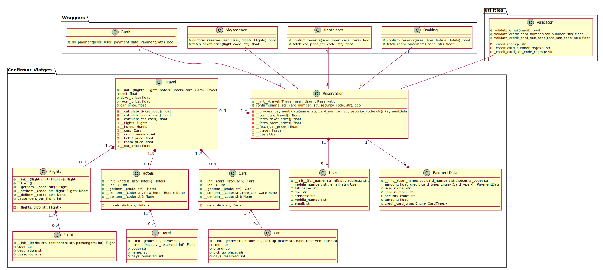

# ES-2020-412-06
ES 2020 UAB COVID-19 Edition

## Miembros
Joan Rosell - 1423759

Lucas Gonzalo Priego - 1492658

Arnau Closa Manteca - 1535791

Victor Castro García - 1494644

David Méndez Ribera - 1420576

## Recomendaciones
A continuación se listan un conjunto de recomendaciones para que podamos trabajar todos juntos con menos dolores de cabeza.

### 0.0 Configuración de entorno virtual Python 3.7.x para el desarrollo
Puesto que Python requiere de un intérprete debemos tener ciertas consideraciones en mente a la hora de configurar nuestro entorno de desarrollo. Lo mas recomendable es crear un entorno virtual para ejecutar el proyecto de forma aislada. Esto es útil para evitar conflictos con otros packages de vuestro sistema y para administrar las dependencias.
#### 0.1 Creación de un intérprete en entorno virtual
Guía oficial para PyCharm: https://www.jetbrains.com/help/pycharm/creating-virtual-environment.html
Una vez esté creado el intérprete tenéis que seleccionarlo desde la interfaz de PyCharm (esquina inferior derecha). Si lo habeis hecho todo bien al abrir el terminal de sistema desde la propia interfaz de PyCharm os debería salir algo así:

```(venv) C:\path\to\ES-2020-412-06> ``` 

#### 0.2 Instalación de las dependencias del proyecto
Para instalar los packages que necesitemos es tan sencillo como ejecutar el siguiente comando:

``` pip install -r requirements.txt ```

Una vez pip termine de instalar los packages el entorno ya estará listo y todas las dependencias quedarán resueltas.

### 1.0 Uso de pytest
Para utilizar pytest es recomendable usar el siguiente comando:

``` python -m pytest tests/ ```

***IMPORTANTE Debeis ejecutarlo desde el directorio raíz del proyecto***

## Diagrama de clases

